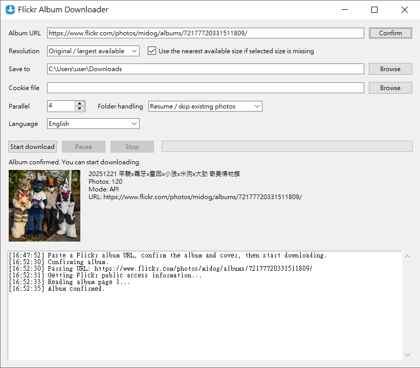

# Flickr Album Downloader

[繁體中文說明](README.zh_TW.md)



Flickr Album Downloader is a small desktop tool for saving Flickr albums to a local folder. It supports public albums, Flickr share links, guest pass links, and private albums that you can access in your signed-in browser.

Current version: `1.1.1`

## Download

Download the packaged app from the [Releases page](https://github.com/Minwei21144/Flickr-Album-Downloader/releases).

Release files:

- Windows: `FlickrAlbumDownloader-1.1.1-windows-x64.exe`, `windows-x86.exe`, `windows-arm64.exe`
- macOS unsigned app ZIP: `FlickrAlbumDownloader-1.1.1-macos-arm64.app.zip`, `macos-x64.app.zip`
- Linux AppImage: `FlickrAlbumDownloader-1.1.1-linux-x64.AppImage`, `linux-arm64.AppImage`

macOS builds are unsigned unless Apple Developer ID notarization secrets are configured. See [unsigned macOS install notes](docs/macos-unsigned-install.md).

## Features

- Simple Windows, macOS, and Linux desktop app.
- GUI language switch: English and Traditional Chinese.
- Supports standard album URLs, short share URLs, and guest pass URLs.
- Optional `cookies.txt` import for private albums you can view while signed in.
- Original / largest available download by default.
- Optional fallback to the nearest available size when the selected size is missing.
- Downloads photos and videos when Flickr exposes downloadable video URLs.
- Pause, resume, stop, and resume-from-existing-file workflows.
- Parallel downloads with user-selectable worker count.
- Folder conflict handling: resume, skip, overwrite, or save as a new folder.
- Built-in retry and backoff for Flickr HTTP 429 rate limiting.

## Usage Notes

- Use this tool only for albums and files you are allowed to access and save.
- Private albums require browser cookies from a Flickr session that already has access.
- High parallel download counts can trigger Flickr HTTP 429. For large original-size albums, start with `1` worker and resume mode, then increase gradually.
- If 429 continues for more than about 10 minutes, wait and try later. Do not repeatedly switch IP addresses to bypass service limits.

## Cookie File

For private albums, export cookies from a browser where you are already signed in to Flickr. The file must use Netscape `cookies.txt` format. Keep this file private; it may allow access to your Flickr session.

## Folder Conflict Modes

- `resume`: keep the folder and skip files that already exist.
- `skip`: skip the album if the folder already exists.
- `overwrite`: delete and recreate the album folder.
- `rename`: save to a new folder such as `Album Name (2)`.

## Command Line

The packaged app is intended for normal desktop use. The Python source also supports command-line usage:

```bash
python flickr_album_downloader.py --cli \
  --url "https://www.flickr.com/photos/user/albums/72177720300000000/" \
  --resolution original \
  --workers 1 \
  --conflict resume \
  --output "./downloads"
```

Private or guest pass album with cookies:

```bash
python flickr_album_downloader.py --cli \
  --cookies "./cookies.txt" \
  --url "https://www.flickr.com/gp/user/code" \
  --output "./downloads"
```

## Development

Python 3.10 or newer is recommended for source runs and local development.

```bash
python -m pip install -r requirements.txt
python flickr_album_downloader.py
python -m unittest discover -s tests
```

Release builds are handled by `.github/workflows/build.yml`. Windows local builds can use `build_windows.ps1`.

## macOS Packaging

Without Apple Developer ID secrets, GitHub Actions publishes unsigned `.app.zip` files. This avoids Gatekeeper blocking an unsigned DMG before it can mount, but users still need to explicitly allow the extracted app. See [unsigned macOS install notes](docs/macos-unsigned-install.md).

If Apple Developer ID and App Store Connect API secrets are configured, GitHub Actions signs the `.app`, signs the `.dmg`, submits the DMG for Apple notarization, staples the notarization ticket, and verifies the result. See [macOS notarization setup](docs/macos-notarization.md).

## License

This project's own source code is licensed under the [MIT License](LICENSE).

Built applications may include third-party runtime components such as Python, Tcl/Tk, Pillow, and certifi. See [THIRD_PARTY_NOTICES.md](THIRD_PARTY_NOTICES.md) for details.

## Flickr API References

- Flickr `flickr.photosets.getPhotos`: <https://www.flickr.com/services/api/flickr.photosets.getPhotos.html>
- Flickr URL formats: <https://www.flickr.com/services/api/misc.urls.html>
